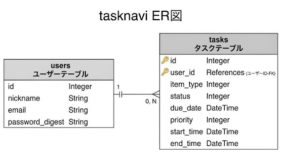
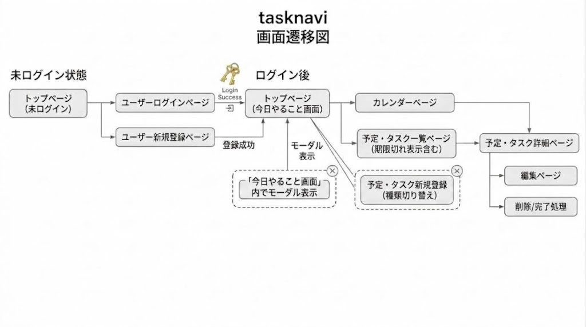

# アプリケーション名

TaskNavi

## アプリケーション概要

TaskNaviは、日々のタスクや予定をまとめて管理できるアプリケーションです。

タスクの期限や優先度、予定の日時などを登録し、今日や今後の予定を一覧やカレンダーから確認できます。

タスクと予定を一元管理することで、期限や予定の見落としを防ぐことを目的としています。

## URL

https://tasknavi.onrender.com

## テスト用アカウント

- メールアドレス：test@test.com
- パスワード：testtest

## 利用方法

1. テスト用アカウントでログインします。
2. 「予定・締め切りを追加」から、タスクまたは予定を登録します。
3. タスクの場合は、締め切り日時や優先度を設定します。
4. 予定の場合は、開始日時と終了日時を設定します。
5. 登録したタスクや予定を「タスク・予定一覧」から確認できます。
6. 今日のタスク・予定は「今日のタスク・予定」画面から確認できます。
7. 「カレンダー表示」から、登録したタスクや予定を日付ごとに確認できます。
8. 登録したタスクや予定は、編集・削除できます。
9. タスクを完了した場合は、「今日のタスク」「タスク・予定一覧」からチェックボックスで完了状態に変更できます。

## アプリケーションを作成した背景

複数の予定や締め切りを抱えた際に、「何をいつまでにやればいいのか分からなくなる」という課題を解決するために、TaskNaviを制作しました。

実際に、複数の予定や締め切りを抱えたことで、予定そのものを把握できなかったり、優先順位が分からなくなってダブルブッキングをしてしまった経験があります。

そこで、タスクの期限や優先度、予定の日時を一元管理し、今日や今後の予定を一覧やカレンダーから確認できるようにしました。

TaskNaviを利用することで、やるべきことや予定を明確にし、優先順位を整理しながら迷わず行動できるようにすることを目指しています。

## 実装した機能についての画像やGIFおよびその説明

タスク・予定の登録

タスクを登録する場合

https://gyazo.com/84a63754f7dade96eb2d2bbbe0512b4b

タスクの期限や優先度を設定して登録できます。

予定を登録する場合

https://gyazo.com/6293c7ef38119666bdda50ebeb7c0878

予定の開始日時と終了日時を設定して登録できます。

今日のタスク・予定

https://gyazo.com/8030a8e0b8448f9cde468c7b845ca02f

今日のタスクや予定を一覧で確認できます。タスクの完了・未完了も管理できます。

カレンダー表示

https://gyazo.com/025ffdb087f939c0e1343f34477373fe

登録したタスクや予定をカレンダー上で確認できます。日付ごとの予定を視覚的に把握できます。

タスク・予定の編集・削除

https://gyazo.com/c2bfcf1615522a884339bd227fd05dec

https://gyazo.com/87780599862e97edd8047f5a08f05840

登録したタスクや予定の内容を編集・削除できます。

## 実装予定の機能

1. **締め切り前の通知機能**

   * タスクや予定の締め切りが近づいた際に通知し、期限や予定の見落としを防げるようにします。

2. **レスポンシブ対応**

   * スマートフォンやタブレットなど、さまざまな画面サイズでも利用しやすいようにします。

3. **カテゴリー機能**

   * タスクや予定をカテゴリーごとに分類し、目的や内容に応じて整理できるようにします。

## データベース設計

## 画面遷移図

## 開発環境

* Ruby 3.2.0
* Ruby on Rails 7.1.6
* JavaScript
* HTML / CSS
* MySQL
* Sequel Ace
* GitHub
* GitHub Desktop
* Visual Studio Code
* Render

## ローカルでの動作方法

以下のコマンドを実行してください。

git clone https://github.com/ryu0120/tasknavi.git

cd tasknavi

bundle install

rails db:create

rails db:migrate

rails server

ブラウザで http://localhost:3000 にアクセスしてください。

## 工夫したポイント

### 制作背景

日常生活の中で、口頭で決めた予定や締め切りを忘れてしまったり、「今日やるべきこと」と「今後の予定」が混在して分かりにくくなった経験から、タスクと予定をまとめて管理できるアプリを制作しました。

### タスクと予定を分けた管理

「タスク」と「予定」では必要な情報が異なるため、種類に応じて入力項目やバリデーションを切り替えるようにしました。タスクには期限・優先度、予定には開始・終了時間を設定できるようにし、それぞれの用途に合わせて管理できるよう工夫しました。

### カレンダー表示

登録したタスクや予定を日付・時間単位で確認できるよう、カレンダー表示を実装しました。タスクと予定では開始・終了時間の扱いが異なるため、カレンダー表示用のメソッドをモデルに用意し、同じカレンダー上で表示できるようにしました。また、Simple Calendarを利用しつつ、TaskNaviのデザインに合わせてCSSを調整しました。

### JavaScript・Turboを利用した操作性の改善

タスクの完了状態を画面遷移なしで更新できるようJavaScriptを使用しました。また、タスク・予定の登録フォームをモーダルで表示し、現在の画面から離れずに登録できるようにしました。

### 開発・タスク管理

機能ごとに実装・動作確認・修正を繰り返しながら開発を進めました。Gitを使用して変更内容を管理し、機能単位でコミットすることで、変更履歴を確認しやすくしました。また、RuboCopを使用してコードの品質を確認し、指摘された箇所を修正しました。

## 改善点

* カレンダーの表示月を切り替える際、`params[:month]` に不正な値が渡された場合でも画面が落ちないよう、エラーハンドリングを強化します
* Turboによる画面遷移に伴うJavaScriptのイベント管理を改善します
* カレンダー上で複数のタスク・予定が登録されている場合でも、内容を確認しやすい表示方法を検討します
* 各機能のテストコードを充実させ、より安定したアプリケーションを目指します

## 制作期間

約2週間
